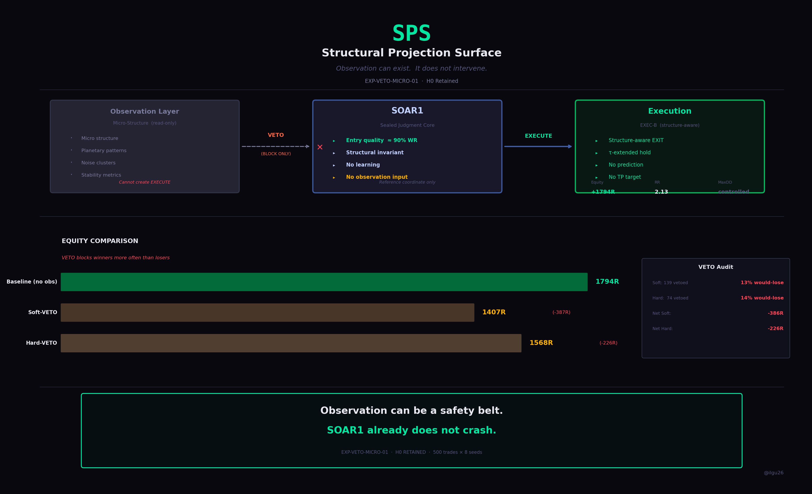

# SPS — Structural Projection Surface

This repository is **not documentation**  
and **not an implementation**.

It is a **structural projection surface** used to
observe, anchor, and verify the evolution of SOAR-based systems.

---

## ▶ View the Surface

### Live Page (GitHub Pages)
🔗 https://ilgu26-wq.github.io/sps-structural-view/

> If this shows a 404, GitHub Pages deployment may still be in progress.

### Direct HTML (always works)
- index (baseline):  
  🔗 https://github.com/ilgu26-wq/sps-structural-view/blob/main/index.html  
- index2 (current / extended):  
  🔗 https://github.com/ilgu26-wq/sps-structural-view/blob/main/index2.html  

> Click **“View raw”** to open the exact HTML surface.

---

## What This Repository Is

This repository exists to **project and display structural state**, not behavior.

- ❌ No execution
- ❌ No training
- ❌ No optimization
- ❌ No parameter tuning

The HTML files are the **authoritative artifacts**.  
The repository exists only to anchor, version, and publish them.

---

## Reference Core vs Growing Core (Important)

To make growth **observable and falsifiable**, this surface explicitly separates:

- **SOAR1**  
  A sealed, invariant reference core  
  (used only as a coordinate system)

- **Growing SOAR**  
  The evolving architecture under study

SOAR1 is **not the subject** of improvement.  
Growth is defined **relative to a fixed reference**, not by self-modification.

This surface exists to preserve that reference.

---

## Structural Evidence — Observation VETO Test

This repository includes a single canonical experiment,
used to test whether **observation-only blocking**
improves execution quality when applied to a sealed core.

### Experiment
**EXP-VETO-MICRO-01**

- Core: **SOAR1 (fixed, sealed)**
- Exit profile: **EXEC-B (fixed)**
- Variable: observation-based **BLOCK only**
  - No new EXECUTE signals introduced
- Data: identical historical runs

### Verdict
**H0 RETAINED — Observation VETO does NOT improve SOAR1**

### Results

| Arm | Trades | WR | RR | Expectancy | Equity |
|-----|--------|----|----|------------|--------|
| A: Baseline | 500 | 89.6% | 2.13 | +3.59 | **+1794R** |
| B: Soft-VETO | 361 | 90.6% | 2.27 | +3.90 | +1407R |
| C: Hard-VETO | 426 | 90.2% | 2.16 | +3.68 | +1568R |

### Analysis

- VETO blocked a large fraction of **winning trades**
- Among blocked trades:
  - Soft-VETO: only **13%** were actual losses
  - Hard-VETO: only **14%** were actual losses
- Net impact:
  - Soft-VETO: **−386R**
  - Hard-VETO: **−226R**

Observation-based blocking reduced total equity,
despite marginal improvements in WR / RR / Expectancy.

### Conclusion

> **Observation can act as a safety belt.  
> But SOAR1 already does not crash.  
> Adding a belt only slows it down.**

For SOAR1-level entry quality (~90% WR),
observation-based VETO removes more valid structure
than it prevents losses.

### Artifacts

---

## Scope Boundary (Read This First)

This repository answers **one question only**:

> *“What does the structure look like, and how does it change?”*

It does **not** attempt to:
- justify profitability
- optimize decisions
- explain behavior post-hoc

Those belong elsewhere.

This surface exists to keep structure **visible, stable, and auditable**.
